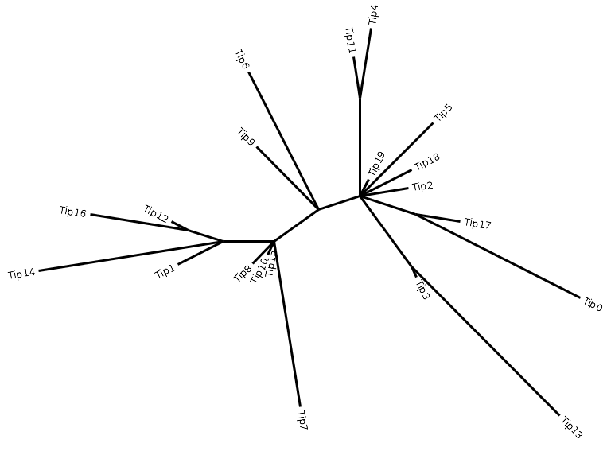
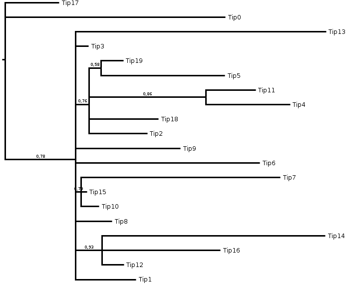

.. _clear-page:

gotree collapse
===============

**Informations**
----------------
This command collapsed branches of an input tree. Two methods are implemented:
- Collapsing short branches;
- Collapsing lowly supported branches.

**Usage**
---------

.. code:: bash

   Usage:
     gotree collapse [command]

   Available Commands:
     length      Collapse short branches of the input tree
     support     Collapse lowly supported branches of the input tree

   Flags:
     -i, --input string    Input tree (default "stdin")
     -o, --output string   Collapsed tree output file (default "stdout")

**Sub-commands**
----------------

gotree collapse length
~~~~~~~~~~~~~~~~~~~~~~

- **Description** : Collapses branches whose length is less than or equal to a given cutoff. The output tree may be multifurcated.
  
- **Usage**:

.. code:: bash

   Usage:
     gotree collapse length [flags]
   
   Flags:
     -l, --length float   Length cutoff to collapse branches
   
   Global Flags:
     -i, --input string    Input tree (default "stdin")
     -o, --output string   Collapsed tree output file (default "stdout")

- **Example**:

.. code-block:: bash

    gotree generate yuletree -l 20 -s 30 | gotree collapse length -l 0.5 > tree.nw

Should give:

gotree collapse support
~~~~~~~~~~~~~~~~~~~~~~~

- **Description** : Collapses branches having a support less than or equal to a given support. The output tree may be multifurcated.
  
- **Usage**:

.. code:: bash

   Usage:
     gotree collapse support [flags]
   
   Flags:
     -s, --support float   Support cutoff to collapse branches
   
   Global Flags:
     -i, --input string    Input tree (default "stdin")
     -o, --output string   Collapsed tree output file (default "stdout")

- **Example**:

.. code-block:: bash

   gotree generate yuletree -l 20 -s 30 \
     | gotree randsupport -s 30         \
     | gotree collapse support -s 0.5   \
     > tree.nw

Can give:

