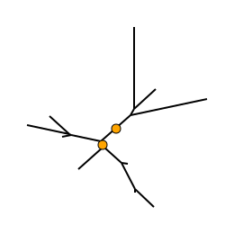
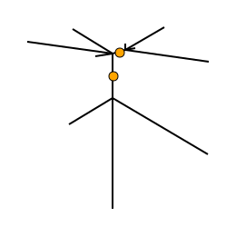

# Gotree: toolkit and api for phylogenetic tree manipulation

## Commands

### collapse
This command removes branches from a set of input trees. Three subcommands :
* `gotree collapse length`  will remove branches whose length is less than or equal to the specified length;
* `gotree collapse support` will remove branches whose support is less than the specified support;
* `gotree collapse depth` will remove branches whose depth is between (or equal to) given min and max depths. Here, depth is defined as the number of taxa on the lightest side of the branch.

#### Usage

General command
```
Usage:
  gotree collapse [command]

Available Commands:
  depth       Collapse branches having a given depth
  length      Collapse short branches of the input tree
  support     Collapse lowly supported branches of the input tree

Flags:
  -i, --input string    Input tree (default "stdin")
  -o, --output string   Collapsed tree output file (default "stdout")
```

depth sub-command
```
Usage:
  gotree collapse depth [flags]

Flags:
  -M, --max-depth int   Max Depth cutoff to collapse branches
  -m, --min-depth int   Min depth cutoff to collapse branches

Global Flags:
  -i, --input string    Input tree (default "stdin")
  -o, --output string   Collapsed tree output file (default "stdout")
  -t, --threads int     Number of threads (Max=12) (default 1)
```

length sub-command
```
Usage:
  gotree collapse length [flags]

Flags:
  -l, --length float   Length cutoff to collapse branches

Global Flags:
  -i, --input string    Input tree (default "stdin")
  -o, --output string   Collapsed tree output file (default "stdout")
```

support sub-command
```
Usage:
  gotree collapse support [flags]

Flags:
  -s, --support float   Support cutoff to collapse branches

Global Flags:
  -i, --input string    Input tree (default "stdin")
  -o, --output string   Collapsed tree output file (default "stdout")
```

#### Examples

1. Removing branches with length < 0.05

```
gotree generate yuletree -s 10 | gotree draw svg -w 200 -H 200 --no-tip-labels -r  > commands/collapse_tree.svg
gotree generate yuletree -s 10 | gotree collapse length -l 0.05 | gotree draw svg -w 200 -H 200 --no-tip-labels -r > commands/collapse_length.svg
```
Original tree                       |             Collapsed tree
------------------------------------|---------------------------------------
 | 

2. Removing branches with support < 0.7

```
gotree generate yuletree -s 10 | gotree randsupport -s 10 | gotree draw svg -w 200 -H 200 --no-tip-labels -r --with-branch-support --support-cutoff 0.7 > commands/collapse_tree2.svg
gotree generate yuletree -s 10 | gotree randsupport -s 10 | gotree collapse support -s 0.7 | gotree draw svg -w 200 -H 200 --no-tip-labels -r --with-branch-support --support-cutoff 0.7 > commands/collapse_support.svg
```

Original tree                       |             Collapsed tree
------------------------------------|---------------------------------------
| 

2. Removing branches with depth 2 (cherries)

```
gotree generate yuletree -s 10 | gotree draw svg -w 200 -H 200 --no-tip-labels -r > commands/collapse_tree.svg
gotree generate yuletree -s 10 | gotree collapse depth -m 2 -M 2 | gotree draw svg -w 200 -H 200 --no-tip-labels -r  > commands/collapse_depth.svg
```

Original tree                       |             Collapsed tree
------------------------------------|---------------------------------------
| 
