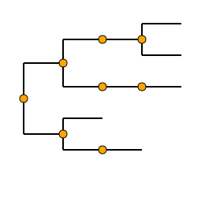
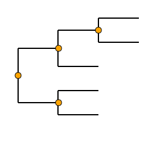

# Gotree: toolkit and api for phylogenetic tree manipulation

## Commands

### collapse
This command removes branches from a set of input trees.  They apply only to internal branches, and not to branches connected to the root (for rooted trees). Three subcommands :
* `gotree collapse length`  will remove branches whose length is less than or equal to the specified length;
* `gotree collapse support` will remove branches whose support is less than the specified support;
* `gotree collapse depth` will remove branches whose depth is between (or equal to) given min and max depths. Here, depth is defined as the number of taxa on the lightest side of the branch.
* `gotree collapse single` will remove internal nodes and branches that form linear internal paths. For example:

```
           t1           t1
           /	       /
 n0--n1--n2   => n0--n2
           \	       \
            t2          t2
```

- If option `--tips` is given, length of tips matching the threshold will be set to 0.0 (for `depth` and `length` commands).
- If option `--root` is given, branches connected to the root (in the case of rooted trees) and matching the threshold will be removed (for `depth`, `length`, and `support` commands). Resulting tree may be unrooted. Also, so far the two branches connected to the root are considered independently whereas it may be more useful to consider them as a single bipartition if the tree is going to be unrooted.

#### Usage

General command
```
Usage:
  gotree collapse [command]

Available Commands:
  clade       Collaps the clade defined by the given tip names
  depth       Collapse branches having a given depth
  length      Collapse short branches of the input tree
  single      Collapse branches that connect single nodes
  support     Collapse lowly supported branches of the input tree

Flags:
  --format string       Input tree format (newick, nexus, or phyloxml) (default "newick")
  -i, --input string    Input tree (default "stdin")
  -o, --output string   Collapsed tree output file (default "stdout")
```

depth sub-command
```
Usage:
  gotree collapse depth [flags]

Flags:
  -M, --max-depth int   Max Depth cutoff to collapse branches
  -m, --min-depth int   Min depth cutoff to collapse branches

Global Flags:
      --format string   Input tree format (newick, nexus, or phyloxml) (default "newick")
  -i, --input string    Input tree (default "stdin")
  -o, --output string   Collapsed tree output file (default "stdout")
```

length sub-command
```
Usage:
  gotree collapse length [flags]

Flags:
  -l, --length float   Length cutoff to collapse branches

Global Flags:
      --format string   Input tree format (newick, nexus, or phyloxml) (default "newick")
  -i, --input string    Input tree (default "stdin")
  -o, --output string   Collapsed tree output file (default "stdout")
```

support sub-command
```
Usage:
  gotree collapse support [flags]

Flags:
  -s, --support float   Support cutoff to collapse branches

Global Flags:
      --format string   Input tree format (newick, nexus, or phyloxml) (default "newick")
  -i, --input string    Input tree (default "stdin")
  -o, --output string   Collapsed tree output file (default "stdout")
```

single sub-command
```
Usage:
  gotree collapse single [flags]

Flags:
  -h, --help   help for single

Global Flags:
      --format string   Input tree format (newick, nexus, or phyloxml) (default "newick")
  -i, --input string    Input tree (default "stdin")
  -o, --output string   Collapsed tree output file (default "stdout")
```

clade sub-command
```
Usage:
  gotree collapse clade [flags]

Flags:
  -h, --help              help for clade
      --strict            Enforce the outgroup to be monophyletic (else throw an error)
  -l, --tip-file string   File containing names of tips of the outgroup (default "none")
  -n, --tip-name string   Name of the tip that will replace the clade (default "none")

Global Flags:
      --format string   Input tree format (newick, nexus, or phyloxml) (default "newick")
  -i, --input string    Input tree (default "stdin")
  -o, --output string   Collapsed tree output file (default "stdout")
```

#### Examples

1. Removing branches with length < 0.05

```
gotree generate yuletree --seed 10 | gotree draw svg -w 200 -H 200 --no-tip-labels -r  > commands/collapse_tree.svg
gotree generate yuletree --seed 10 | gotree collapse length -l 0.05 | gotree draw svg -w 200 -H 200 --no-tip-labels -r > commands/collapse_length.svg
```
Original tree                       |             Collapsed tree
------------------------------------|---------------------------------------
 | 

2. Removing branches with support < 0.7

```
gotree generate yuletree --seed 10 | gotree randsupport --seed 10 | gotree draw svg -w 200 -H 200 --no-tip-labels -r --with-branch-support --support-cutoff 0.7 > commands/collapse_tree2.svg
gotree generate yuletree --seed 10 | gotree randsupport --seed 10 | gotree collapse support -s 0.7 | gotree draw svg -w 200 -H 200 --no-tip-labels -r --with-branch-support --support-cutoff 0.7 > commands/collapse_support.svg
```

Original tree                       |             Collapsed tree
------------------------------------|---------------------------------------
| 

2. Removing branches with depth 2 (cherries)

```
gotree generate yuletree --seed 10 | gotree draw svg -w 200 -H 200 --no-tip-labels -r > commands/collapse_tree.svg
gotree generate yuletree --seed 10 | gotree collapse depth -m 2 -M 2 | gotree draw svg -w 200 -H 200 --no-tip-labels -r  > commands/collapse_depth.svg
```

Original tree                       |             Collapsed tree
------------------------------------|---------------------------------------
| 

3. Removing internal nodes/branches that form linear paths

```
echo "((((A,B)),((C))),(D,(E)));" | gotree draw svg -w 200 -H 200 --with-node-symbols --no-tip-labels > commands/collapse_single.svg
echo "((((A,B)),((C))),(D,(E)));" | gotree collapse single | gotree draw svg -w 200 -H 200 --with-node-symbols --no-tip-labels > commands/collapse_single_out.svg
```

Original tree                       |             Collapsed tree
------------------------------------|---------------------------------------
| 

4. Collapsing a clade

tree
```
      +----- l4                                   
      |                                           
+-----|                       +---------- l5      
|     |     +---------------- |                   
|     +-----|                 +----------------- l7
|           |                                     
|           +---------------- l6                  
|                                                 
|     +---------- l2                              
+-----|                                           
      +----------------- l3                       
```

```
$ gotree collapse clade -i tree.nw -n new l5 l7

      +----- l4                    
+-----|                            
|     |     +------------------ new
|     +-----|                      
|           +------------------ l6 
|                                  
|     +------------ l2             
+-----|                            
      +------------------ l3       
```

```
$ gotree collapse clade -i tree.nw -n new l4 l6

+----- new                    
|                             
|     +------------- l2       
+-----|                       
      +------------------- l3 
```
