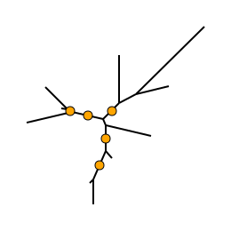
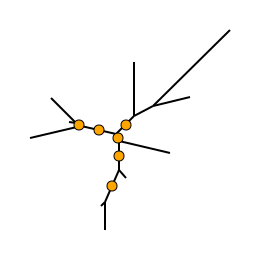
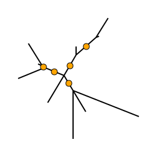

# Gotree: toolkit and api for phylogenetic tree manipulation

## Commands

### compute
This command performs different computations. Sub-commands:
* `gotree compute bipartitiontree`: Builds a tree with only one branch/bipartition. It takes an input tree, and a set of tip/leave names. It will build one tree with left tips being the given ones, and right tips the remaining of the input tree tips.
* `gotree compute consensus` : Computes a consensus tree from a set of input trees (`-i`). As input, `-f` sets the minimum required frequency of the branch (more than or equal to 0.5). As output, produces a consensus tree with:
  1. Branch label being the proportion of trees in which the bipartition is present;
  2. Branch length begin the average length of this branch branch over all the trees where it is present;
* `gotree compute edgetrees` : For each branch of the input tree, builds a tree with this edge as single edge;
* `gotree compute support classical`: Computes standard bootstrap proportions using a reference tree (`-i`) and a set of bootstrap trees (`-b`);
* `gotree compute support booster`: Computes [booster bootstrap supports](http://booster.c3bi.pasteur.fr) using a reference tree (`-i`) and a set of bootstrap trees (`-b`). Moreover, it is possible to get the taxa that move the most around branches of the reference tree with options `--moved-taxa`, by considering only reference branches with a transfer distance less than `--dist-cutoff` to the bootstrap tree.

#### Usage

General command
```
Usage:
  gotree compute [command]

Available Commands:
  bipartitiontree Builds a tree with only one branch/bipartition
  consensus       Computes the consensus of a set of trees
  edgetrees       For each edge of the input tree, builds a tree with only this edge
  roccurve        Computes true positives and false positives at different thresholds
  support         Computes different kind of branch supports
```

bipartitiontree command
```
Usage:
  gotree compute bipartitiontree [flags]

Flags:
  -i, --input string     Input tree (default "stdin")
  -o, --output string    Output tree (default "stdout")
  -f, --tipfile string   Tip file (default "none")
```

Consensus command
```
Usage:
  gotree compute consensus [flags]

Flags:
  -f, --freq-min float   Minimum frequency to keep the bipartitions (default 0.5)
  -i, --input string     Input tree (default "stdin")
```

Classical support command
```
Usage:
  gotree compute support classical [flags]

Global Flags:
  -b, --bootstrap string   Bootstrap trees input file (default "none")
  -l, --log-file string    Output log file (default "stderr")
  -o, --out string         Output tree file, with supports (default "stdout")
  -i, --reftree string     Reference tree input file (default "stdin")
      --silent             If true, progress messages will not be printed to stderr
  -t, --threads int        Number of threads (Max=12) (default 1)
```

Booster support command
```
Usage:
  gotree compute support booster [flags]

Flags:
      --dist-cutoff float   If --moved-taxa, then this is the distance cutoff to consider a branch for
                            moving taxa computation. It is the normalized distance to the current bootstrap
			    tree (e.g. 0.05). Must be between 0 and 1, otherwise set to 0 (default 0.05)
      --moved-taxa          If true, will print in log file (-l) taxa that move the most around branches

Global Flags:
  -b, --bootstrap string   Bootstrap trees input file (default "none")
  -l, --log-file string    Output log file (default "stderr")
  -o, --out string         Output tree file, with supports (default "stdout")
  -i, --reftree string     Reference tree input file (default "stdin")
      --silent             If true, progress messages will not be printed to stderr
  -t, --threads int        Number of threads (Max=12) (default 1)
```

#### Examples

* We generate a random tree, and build a tree with one bipartition have on the left (Tip1, Tip2, Tip3)
```
gotree generate yuletree -s 10 | gotree compute bipartitiontree Tip1 Tip2 Tip3
```

* We generate a random phylogenetic tree with gotree, 1 alignment with seq-gen, and we infer a tree with FastTree

```
gotree generate yuletree -s 10 > tree.nw
seq-gen -q -op -a0.5 -g4 -mGTR -l500 -r 3 5 7 4 6 2 -f 0.25 0.15 0.2 0.4 -z 20 tree.nw -n 1 > align.ph
FastTree align.ph > inferred.nw
```

* We generate 100 bootstrap alignments with [goalign](https://github.com/fredericlemoine/goalign)

```
goalign build seqboot -i align.ph -n 100 -p -o align_boot
cat align_boot* | FastTree -n 100 > bootstraps.nw
```

* We compute a 70% consensus
```
gotree compute consensus -i bootstraps.nw -f 0.7 -o consensus.nw
```

* We compute standard bootstrap proportions
```
gotree compute support classical -i inferred.nw -b bootstraps.nw -o standard.nw
```

* We compute booster supports
```
gotree compute support booster -i inferred.nw -b bootstraps.nw -o booster.nw
```

* We draw supports
```
gotree draw svg -i standard.nw -r -w 200 -H 200 --with-branch-support --no-tip-labels  --support-cutoff 0.7 > commands/compute_standard.svg
gotree draw svg -i booster.nw -r  -w 200 -H 200 --with-branch-support --no-tip-labels  --support-cutoff 0.7 > commands/compute_booster.svg
gotree draw svg -i consensus.nw -r  -w 200 -H 200 --with-branch-support --no-tip-labels --support-cutoff 0.7 > commands/compute_consensus.svg
```

Standard supports                          | Booster supports                         | Consensus
-------------------------------------------|------------------------------------------|------------------------------------
 |  | 
