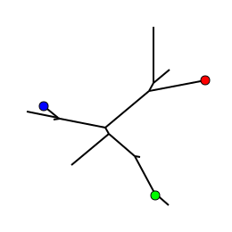

# Gotree: toolkit and api for phylogenetic tree manipulation

## Commands

### draw
This command draws trees with basic functionalities. It implements 3 layouts (normal, radial, circular) and 3 output formats (text, png and svg). Different options are possible such as drawing circles at highly supported branches, adding colored circles to specific tips, etc.

#### Usage

```
Usage:
  gotree draw [command]

Available Commands:
  png         Draw trees in png files
  svg         Draw trees in svg files
  text        Print trees in ASCII

Flags:
  -f, --annotation-file string   Annotation file to add colored circles to tip nodes (svg & png)
                                 Tab separated, with <tip-name  Red  Green  Blue> or  
                                 <tip-name hex-value> on each line
  -i, --input string             Input tree (default "stdin")
      --no-branch-lengths        Draw the tree without branch lengths (all the same length)
      --no-tip-labels            Draw the tree without tip labels
  -o, --output string            Output file (default "stdout")
      --support-cutoff float     Cutoff for highlithing supported branches (default 0.7)
      --with-branch-support      Highlight highly supported branches
      --with-node-labels         Draw the tree with internal node labels
```

#### Example

* SVG image, radial layout with branch supports
```
gotree generate yuletree --seed 10 | gotree randsupport --seed 10 | gotree draw svg -r -w 200 -H 200 --with-branch-support --support-cutoff 0.7 -o commands/draw_1.svg
```


* SVG image, circular layout with branch supports
```
gotree generate yuletree --seed 10 | gotree randsupport --seed 10 | gotree draw svg -c -w 200 -H 200 --with-branch-support --support-cutoff 0.7 -o commands/draw_2.svg
```


* SVG image, normal layout with branch supports
```
gotree generate yuletree --seed 10 | gotree randsupport --seed 10 | gotree draw svg -w 200 -H 200 --with-branch-support --support-cutoff 0.7 -o commands/draw_3.svg
```


* SVG image, radial layout with annotated tips and without tip labels
```
echo "Tip1\t255\t0\t0
Tip2\t0\t255\t0
Tip3\t0\t0\t255" > annots.tab
gotree generate yuletree --seed 10 | gotree draw svg -r -w 200 -H 200 --annotation-file annots.tab --no-tip-labels -o draw_4.svg
```



The annotation file can also be specified using HEX color codes, the following annotation file would yield the same figure: 

```
echo "Tip1\t#ff0000
Tip2\t#00ff00
Tip3\t#0000ff" > annots.hex.tab
```
