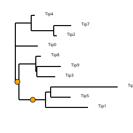
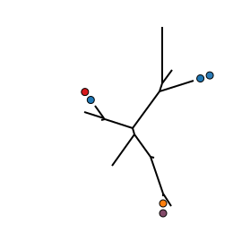

# Gotree: toolkit and api for phylogenetic tree manipulation

## Commands

### draw
This command draws trees with basic functionalities. It implements 3 layouts (normal, radial, circular) and 3 output formats (text, png and svg). Different options are possible such as drawing circles at highly supported branches, adding colored circles to specific tips, etc.

#### Usage

```
Usage:
  gotree draw [command]

Available Commands:
  png         Draw trees in png files
  svg         Draw trees in svg files
  text        Print trees in ASCII

Flags:
  -i, --input string             Input tree (default "stdin")
  -m, --metadata-file string     Tab separated metadata file to add colored markers to tip nodes (svg & png):
                                 tip name in the first column (header ignored), then one column per
                                 metadata field (header = field name). Values are auto-detected as
                                 discrete or continuous; colors and marker shapes are auto-assigned
                                 unless overridden with --metadata-colors. Empty cells draw an unfilled
                                 grey circle.
      --metadata-colors string   Optional YAML file overriding the color scheme and/or marker shape of
                                 one or more --metadata-file fields (discrete value->color map, or
                                 continuous low/high/min/max; shape: circle|square|triangle|diamond|star)
      --no-branch-lengths        Draw the tree without branch lengths (all the same length)
      --no-tip-labels            Draw the tree without tip labels
  -o, --output string            Output file (default "stdout")
      --support-cutoff float     Cutoff for highlithing supported branches (default 0.7)
      --with-branch-support      Highlight highly supported branches
      --with-node-labels         Draw the tree with internal node labels
```

#### Example

* SVG image, radial layout with branch supports
```
gotree generate yuletree --seed 10 | gotree randsupport --seed 10 | gotree draw svg -r -w 200 -H 200 --with-branch-support --support-cutoff 0.7 -o commands/draw_1.svg
```


* SVG image, circular layout with branch supports
```
gotree generate yuletree --seed 10 | gotree randsupport --seed 10 | gotree draw svg -c -w 200 -H 200 --with-branch-support --support-cutoff 0.7 -o commands/draw_2.svg
```


* SVG image, normal layout with branch supports
```
gotree generate yuletree --seed 10 | gotree randsupport --seed 10 | gotree draw svg -w 200 -H 200 --with-branch-support --support-cutoff 0.7 -o commands/draw_3.svg
```



* SVG image, radial layout with tip metadata markers and without tip labels
```
printf "tip\tcountry\tage\nTip1\tFrance\t10\nTip2\tGermany\t50\nTip3\tFrance\t90\n" > metadata.tsv
gotree generate yuletree --seed 10 | gotree draw svg -r -w 200 -H 200 --metadata-file metadata.tsv --no-tip-labels -o draw_4.svg
```



Here `country` is auto-detected as discrete (colors auto-assigned from a
categorical palette) and `age` as continuous (colored along a default
blue-to-red gradient). One marker per metadata column is drawn next to
each tip, in column order: `country` is drawn as circles and `age` as
squares, since marker shape cycles through `circle, square, triangle,
diamond, star` by column position unless overridden. Colors and shapes can
both be pinned down explicitly with `--metadata-colors`, a YAML file keyed
by field name:

```yaml
country:
  type: discrete
  shape: diamond
  colors:
    France: "#e6194b"
    Germany: "#3cb44b"
age:
  type: continuous
  low: "#2c7bb6"
  high: "#d7191c"
  min: 0
  max: 100
```

Attributes omitted from a field's YAML entry (or the field, or the file
itself) fall back to full auto-detection/auto-assignment. A blank cell in
the metadata file draws an unfilled, grey-bordered marker for that
tip/field instead of a colored one.
