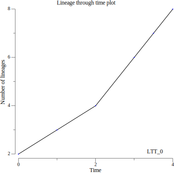

# Gotree: toolkit and api for phylogenetic tree manipulation

## Commands

### ltt

Compute or draw lineage through time data.

Two options:

1) Will output data visualizable in statistical packages (R, python, etc.). Set of x,y coordinates pairs: x: time (or mutations) and y: number of lineages.
2) If `--image <image file>`` is specified, then a ltt plot is generate in the given output file. The format of the image depends on the extension (.png, .svg, .pdf, etc. see [gonum doc](https://github.com/gonum/plot/blob/342a5cee2153b051d94ae813861f9436c5584de2/plot.go#L525C17-L525C17). Image width and height can be specified (in inch) with `--image-width` and `--image-height`.


Example of usage:

```
gotree ltt -i tree.nw -o ltt_data.txt --image ltt_image.pdf --image-width 10 --image-height 10
```

#### Usage

General command
```
Usage:
  gotree ltt [flags]

Flags:
  -h, --help               help for ltt
      --image string       LTT plot image image output file (default "none")
      --image-height int   LTT plot image output heigh (default 4)
      --image-width int    LTT plot image image output width (default 4)
  -i, --input string       Input tree(s) file (default "stdin")
  -o, --output string      LTT output file (default "stdout")

Global Flags:
      --format string   Input tree format (newick, nexus, phyloxml, or nextstrain) (default "newick")
```

#### Examples

* Generate ltt data from an input tree


```
$ echo "(((A:1,B:1):1,C:2):3,(D:4,(E:3,((F:1.5,G:1.5):0.5,H:2):1):1):1);" | gotree draw text -w 50
                                       +-------- A
                             +---------|
+----------------------------|         +-------- B
|                            |
|                            +------------------ C
|
|        +-------------------------------------- D
|        |
+--------|         +---------------------------- E
         |         |
         +---------|              +------------- F
                   |         +----|
                   +---------|    +------------- G
                             |
                             +------------------ H
$ echo "(((A:1,B:1):1,C:2):3,(D:4,(E:3,((F:1.5,G:1.5):0.5,H:2):1):1):1);" | gotree ltt
0	0.000000	2
0	1.000000	3
0	2.000000	4
0	3.000000	6
0	3.500000	7
0	4.000000	8
0	5.000000	0
```

* Generate ltt plot from an input tree

```
$ echo "(((A:1,B:1):1,C:2):3,(D:4,(E:3,((F:1.5,G:1.5):0.5,H:2):1):1):1);" | gotree ltt --image ltt.png --image-width 10 --image-height 10
```


